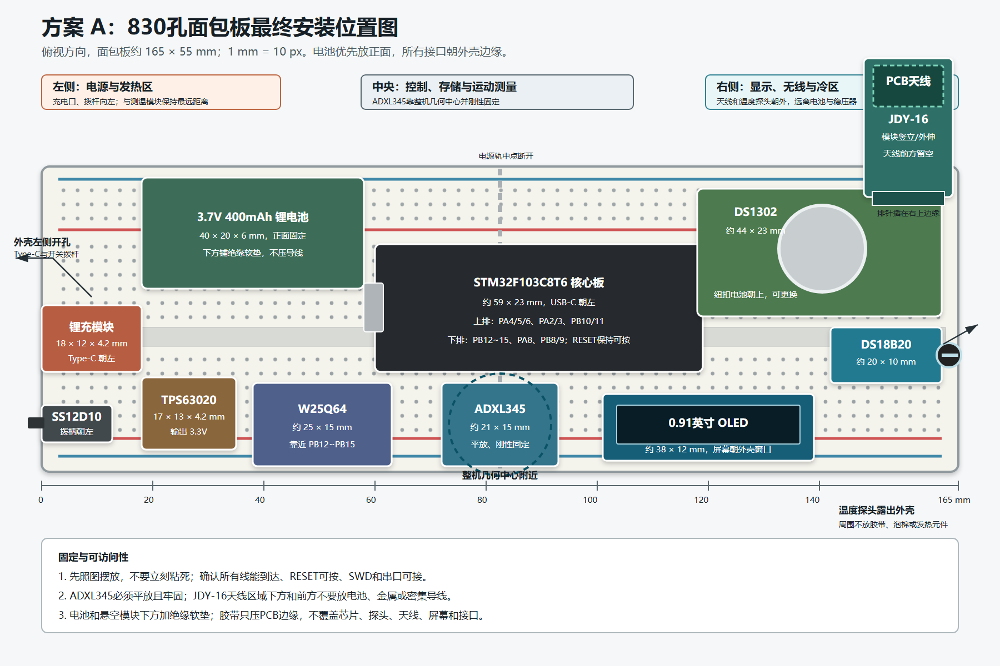
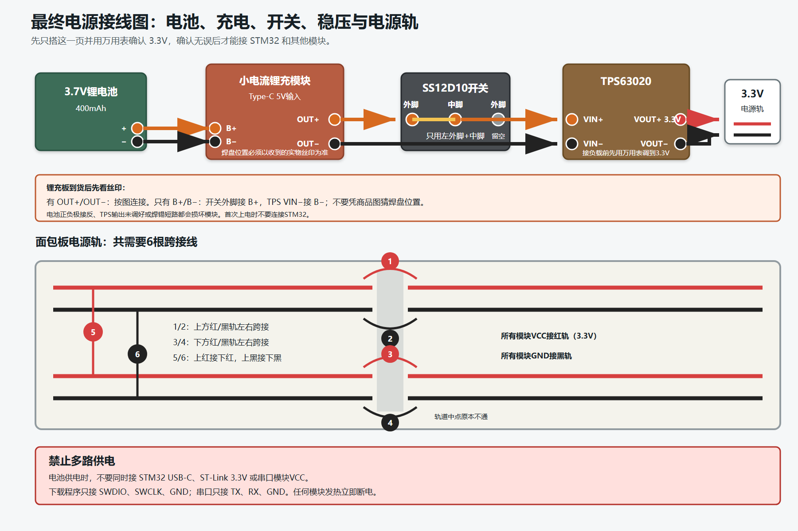
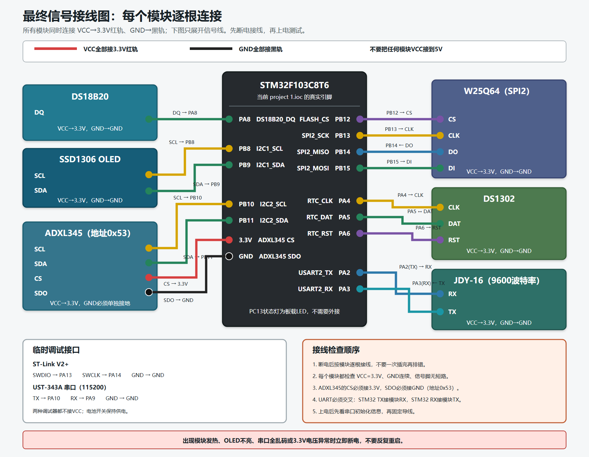
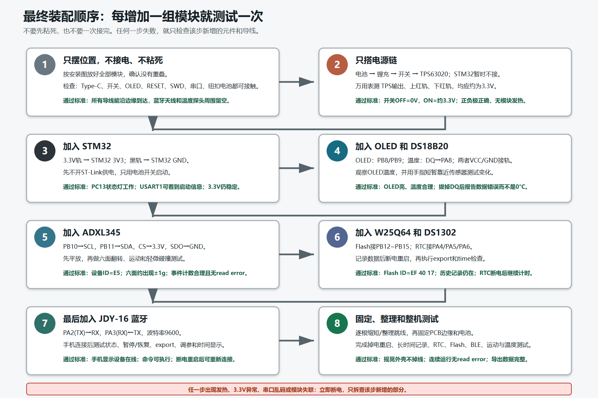

# STM32 Temperature and Motion Logger

A compact STM32F103C8T6 logger that records temperature, motion, and shock events with real timestamps. The device stores data in external Flash, shows live status on an OLED, and exposes status, configuration, event review, and CSV export through a JDY-16 BLE module.

[Open the mobile BLE dashboard](https://hansolo2r.github.io/stm32-transport-logger/)

## Hardware

- STM32F103C8T6 controller
- DS18B20 temperature sensor
- ADXL345 accelerometer
- DS1302 real-time clock
- W25Q64 SPI Flash
- SSD1306 OLED
- JDY-16 BLE module

## Implemented Features

- Periodic temperature logging and motion/shock event detection
- Real calendar timestamps retained by the DS1302 backup cell
- 2,048 fixed-size records in W25Q64 with CRC protection
- Backward-compatible reading of older records without RTC timestamps
- BLE status, pause/resume, sleep/wake, threshold configuration, event preview, and CSV export
- Responsive Chinese mobile dashboard with chronological tables and a real-time temperature chart

## Project Layout

- `project 1.ioc`: CubeMX hardware configuration and pin assignments
- `Core/Src`: application and peripheral drivers
- `Core/Inc`: public firmware headers
- `docs/mobile-app`: Web Bluetooth dashboard deployed by GitHub Pages
- `docs/development-log.md`: implementation decisions, tests, failures, and fixes

## Breadboard Wiring

### Physical placement

### Battery and 3.3 V distribution

### Peripheral signal wiring

### Staged assembly and validation

The diagrams reflect the active CubeMX pin assignments and separate physical placement, power distribution, signal wiring, and staged validation. The selected layout keeps the battery on the front of the board, separates the DS18B20 from the power section, places the ADXL345 near the device center, and leaves the charger, switch, OLED, RTC battery, debug pins, and BLE antenna accessible. The charger pad order must still be confirmed from the received module's silkscreen before battery wiring.

## Current Validation Boundary

The firmware builds with STM32CubeIDE without errors or warnings. Individual sensor, storage, RTC, BLE, and browser workflows have been tested during development. This is a prototype and is not certified for commercial shipment monitoring.
