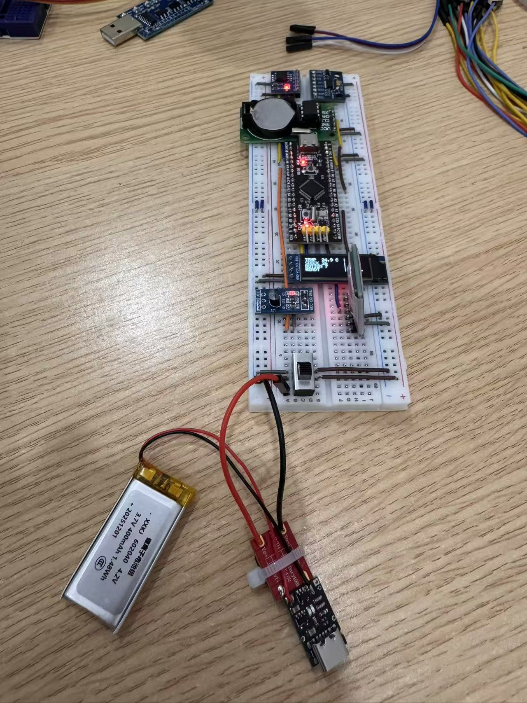
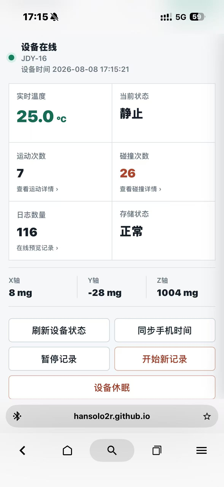
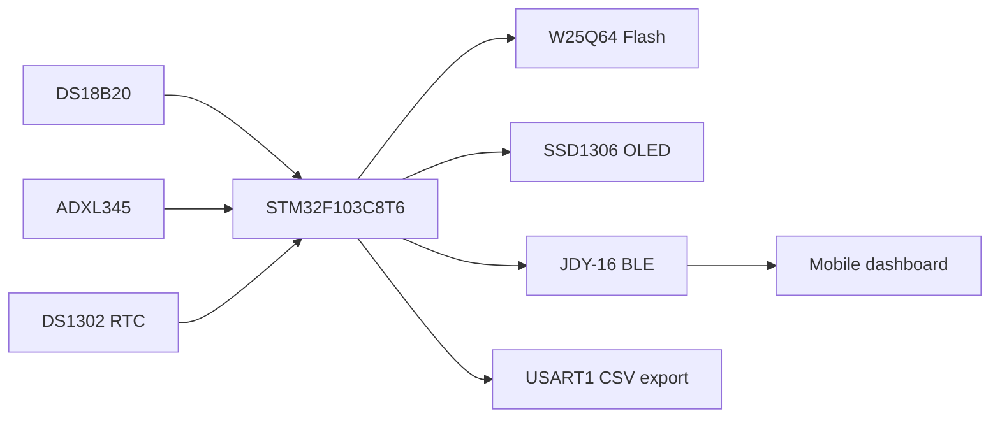

# STM32 Transport Logger

An STM32F103C8T6 breadboard prototype that records temperature, motion
transitions, and light-impact events with RTC timestamps. Records are stored in
W25Q64 Flash and can be inspected through serial commands or a JDY-16 BLE
dashboard.

  
  

[Open the BLE dashboard](https://hansolo2r.github.io/stm32-transport-logger/)

## Functions

- DS18B20 temperature sampling and periodic logging
- Three-axis ADXL345 motion and short-impact classification
- DS1302 calendar timestamps
- CRC-protected circular storage for 2,048 records in W25Q64
- OLED status display and USART1 diagnostic/export commands
- JDY-16 BLE status, event review, time sync, pause/resume, sleep/wake, and parameter configuration

## Hardware

| Part | Interface |
| --- | --- |
| DS18B20 | PA8 |
| SSD1306 | I2C1, PB8/PB9 |
| ADXL345 | I2C2, PB10/PB11 |
| W25Q64 | SPI2, PB12-PB15 |
| DS1302 | PA4/PA5/PA6 |
| JDY-16 | USART2, PA2/PA3, 9600 baud |
| USB-UART | USART1, PA9/PA10, 115200 baud |

The complete component list is in [the BOM](docs/evidence/bom.md). Wiring
drawings under [`docs/wiring`](docs/wiring) are assembly references.

## Parameters and test scope

The motion threshold, shock threshold, confirmation times, cooldown, maximum
shock duration, and temperature interval can be changed through BLE or USART1
and saved in W25Q64.

Current physical checks used hand-held movement and light impacts. The default
settings are intended for that bench setup. Other mounting conditions or event
ranges require new calibration and testing. Cold-chain transport and vehicle
impact testing have not been performed.

## Verification

| Check | Result | Boundary |
| --- | --- | --- |
| Native event-detector tests | 15 scenarios passed | Synthetic acceleration sequences |
| Dashboard tests | 6 tests passed | Simulated BLE messages in Edge/Playwright |
| STM32CubeIDE Debug build | 0 errors, 0 warnings | Compilation only |
| Final firmware flash | Programmed and verified | Does not cover every runtime path |
| Motion and impact behavior | Confirmed on the breadboard | Hand-held checks without labelled reference equipment |
| Serial data export | 420 continuous raw records | Unlabelled development data |

The archived CSV files and their provenance are under
[`docs/evidence/data`](docs/evidence/data). See the
[validation matrix](docs/evidence/test-matrix.md) for the evidence boundary.

## Build and repository layout

Build and test commands are in [docs/build-and-test.md](docs/build-and-test.md).

- `project 1.ioc`: CubeMX pin and peripheral configuration
- `Core/Src`, `Core/Inc`: application code and drivers
- `tests/firmware`: portable event-detector tests
- `docs/mobile-app`: GitHub Pages dashboard
- `docs/evidence`: photos, BOM, test matrix, and device exports

## Limitations

This is a breadboard prototype, not a calibrated instrument or a commercial
transport monitor. Battery endurance, RTC retention during a documented power
off interval, enclosure-level calibration, and real transport trials remain
untested.
