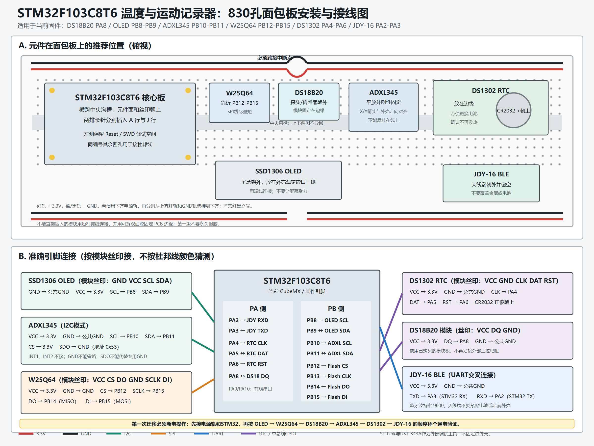

# STM32 Temperature and Motion Logger

A compact STM32F103C8T6 logger that records temperature, motion, and shock events with real timestamps. The device stores data in external Flash, shows live status on an OLED, and exposes status, configuration, event review, and CSV export through a JDY-16 BLE module.

[Open the mobile BLE dashboard](https://hansolo2r.github.io/stm32-transport-logger/)

## Hardware

- STM32F103C8T6 controller
- DS18B20 temperature sensor
- ADXL345 accelerometer
- DS1302 real-time clock
- W25Q64 SPI Flash
- SSD1306 OLED
- JDY-16 BLE module

## Implemented Features

- Periodic temperature logging and motion/shock event detection
- Real calendar timestamps retained by the DS1302 backup cell
- 2,048 fixed-size records in W25Q64 with CRC protection
- Backward-compatible reading of older records without RTC timestamps
- BLE status, pause/resume, sleep/wake, threshold configuration, event preview, and CSV export
- Responsive Chinese mobile dashboard with chronological tables and a real-time temperature chart

## Project Layout

- `project 1.ioc`: CubeMX hardware configuration and pin assignments
- `Core/Src`: application and peripheral drivers
- `Core/Inc`: public firmware headers
- `docs/mobile-app`: Web Bluetooth dashboard deployed by GitHub Pages
- `docs/development-log.md`: implementation decisions, tests, failures, and fixes

## Breadboard Wiring

The diagram reflects the active CubeMX pin assignments and separates physical placement from exact signal mapping. All modules share the 3.3 V and GND rails; the split power rails on a standard 830-point breadboard must be bridged explicitly.

## Current Validation Boundary

The firmware builds with STM32CubeIDE without errors or warnings. Individual sensor, storage, RTC, BLE, and browser workflows have been tested during development. This is a prototype and is not certified for commercial shipment monitoring.
